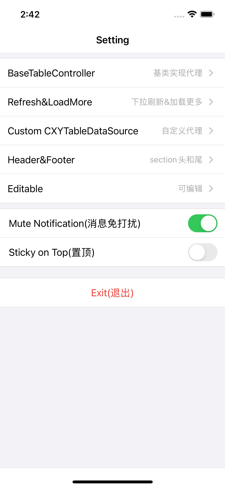

# CXYTableViewExt-Swift
Make UITableView configuration easier. 让你更简单的配置UITableView，极大的简化逻辑


如果你在寻找 OC 版本的话，移步这里 https://github.com/iHongRen/CXYTableViewExt-OC


## Usage(使用) 

1、Customize your Cell , then implement the **CXYTableItemProtocol** protocol

(自定义Cell，然后实现 **CXYTableItemProtocol** 协议)

```swift
extension TextCell: CXYTableItemProtocol {
    func configItem(data: Any?) {
      //TODO: Configure your Cell
    }
}
```


2、Configure your TableView  

(配置TableView，无需提前注册Cells)

```swift
func configTable() {
    self.tableView.t.makeConfig { make in
        make.addCellItems(cellClass: TextCell.self, dataList: Array(1...10))
    }
}
```


## Example1 (例子1)

 

```swift
class SettingController: UIViewController {

    @IBOutlet weak var tableView: UITableView!

    var noti = SettingModel(title: "Mute Notification(消息免打扰)", isOn: true)
    var top = SettingModel(title: "Sticky on Top(置顶)", isOn: false)
  
    override func viewDidLoad() {
        super.viewDidLoad()
        self.title = "Setting"
        
        configTable()
    }
    
    func configTable() {
        self.tableView.t.makeConfig { make in
            
            make.addCellItem(cellClass: LineCell.self)
            make.addCellItem(cellClass: ArrowCell.self, data: SettingModel(title: "BaseTableController", detail: "基类实现代理")) { 
              data, indexPath in
                 ///TODO: didSelectRow
            }
            
            make.addCellItem(cellClass: ArrowCell.self, data: SettingModel(title: "Refresh&LoadMore", detail: "下拉刷新&加载更多")) { 
              data, indexPath in
                ///TODO: didSelectRow
            }
            
            make.addCellItem(cellClass: ArrowCell.self, data: SettingModel(title: "Custom CXYTableDataSource", detail: "自定义代理")) { 
              data, indexPath in
             	  ///TODO: didSelectRow
            }
            
            make.addCellItem(cellClass: ArrowCell.self, data: SettingModel(title: "Header&Footer", detail: "section头和尾")) { 
              data, indexPath in
             	 ///TODO: didSelectRow
            }
           
            make.addCellItem(cellClass: ArrowCell.self, data: SettingModel(title: "Editable", detail: "可编辑")) { 
              data, indexPath in
               ///TODO: didSelectRow
            }
            
            make.addCellItem(cellClass: LineCell.self)
            make.addCellItem(cellClass: SwitchCell.self, data: self.noti, delegate: self)
            make.addCellItem(cellClass: SwitchCell.self, data: self.top, delegate: self)
             
            make.addCellItem(cellClass: LineCell.self, data: LineModel(height: 20))
            make.addCellItem(cellClass: ExitCell.self, data: "Exit(退出)") { 
              data, indexPath in
                print("Exit Clicked")
            }
        }
        
        // handle tableview deselectRow
        self.tableView.t.didSelectItem { tableView, indexPath in
            tableView.deselectRow(at: indexPath, animated: true)
            // get item data (获取所配置的data)
            let data = tableView.t.cellItemData(forIndexPath: indexPath)
            print("did select indexPath(\(indexPath)), data = \(String(describing: data))")
        }
    }
}


// implement SwitchCell delegate
// 实现 cell 的内部代理方法
extension SettingController: SwitchCellDelegate {
    func onSwitchChanged(data: SettingModel, isOn: Bool) {
        print("\(data.title) is changed")
    }
}


////////////////////////// model ////////////////////
struct SettingModel {
    var title = ""
    var detail = ""
    var isOn = false
}

struct LineModel {
    var color: UIColor = .systemGroupedBackground
    var height: CGFloat = 10.0
}
```


**更多的例子，请看代码 [Demo](https://github.com/iHongRen/CXYTableViewExt-Swift/tree/main/CXYTableViewExt-Swift/CXYTableViewExt-Swift/Example)**

